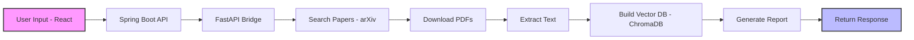
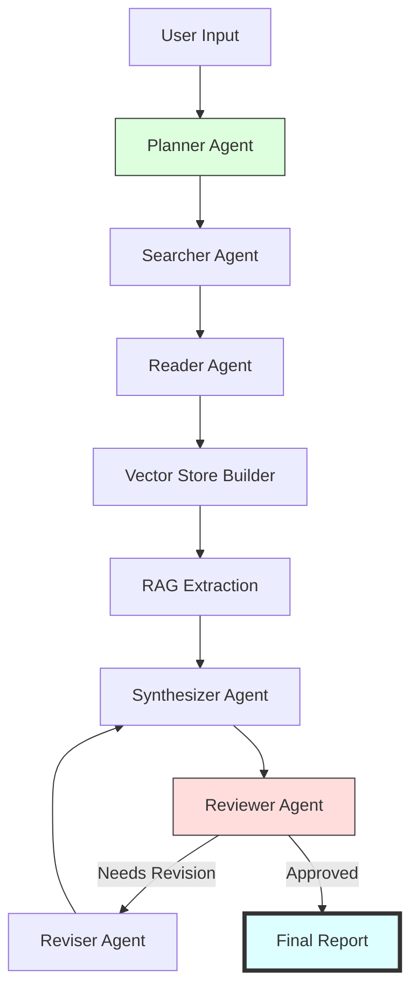

# AI Research Paper Analyzer & Literature Survey Agent 🤖📚

An autonomous AI agent designed to streamline the academic research process. This tool automates the ingestion, analysis, and synthesis of research papers to generate comprehensive literature surveys and critical insights.

# 🚀 Key Features

    Automated Literature Search: Integration with APIs (e.g., ArXiv, Semantic Scholar) to find relevant papers based on keywords.

    Deep PDF Analysis: Extracts methodology, key findings, limitations, and future work from complex academic layouts.

    Literature Survey Generation: Automatically synthesizes multiple papers into a cohesive summary or comparative table.

    Citation Mapping: Identifies influential papers and traces the evolution of specific concepts.

    Interactive Q&A: Chat with your research corpus to find specific details without reading every page.

# 🛠️ Tech Stack

# 📋 Prerequisites

# ⚙️ Installation

    Clone the repository:

    Bash
    git clone https://github.com/SaiSantanu/AI-Research-Paper-Analyzer-Literature-Survey-Agent.git
    cd AI-Research-Paper-Analyzer-Literature-Survey-Agent

# 🤝 Contributing

## Name:Anish Raj
### Date:24/03
Today's Contribution :
I implemented the paper processing pipeline that downloads research papers from arXiv and extracts the text using PyMuPDF so the system can analyze them.

## Name:Abu Unaib
### Date: 25/03
Today's contibution :
Backend Integration: Initiated the setup for the Python-based "Bridge" using Uvicorn and FastAPI.
Environment Troubleshooting: Diagnosed and documented fixes for Python PATH and pip alias conflicts on Windows.
API Research: Researched and selected high-authority Research APIs (OpenAlex and Semantic Scholar) to retrieve verified, high-rank papers for automated literature reviews.

## Name:Dilshad Alam
### Date: 25/03
Today's contibution :
Added Topic Clarifier Agent
Introduced a new clarifier_agent() that runs before the main pipeline. It detects when a user enters a broad or vague topic — such as "cancer", "machine learning", or "climate change" — and automatically asks a short series of targeted follow-up questions to narrow the focus.
For example, entering cancer triggers questions like: which cancer type, which research aspect (detection, treatment, genomics), and preferred methodology. The answers are combined into a refined query such as cancer lung early detection deep learning — which the pipeline then uses for a far more targeted arXiv search.

## Name:Sai Santanu Sahoo
### Date: 25-26/03

# 📊 System Workflow Comparison

## 🔹 Previous Working Workflow (Stable)
The original system followed a **linear ETL-style RAG pipeline**. Data moved in a single direction, making it highly predictable and easy to debug.

# ✅ Characteristics
**Simple linear pipeline:** Easy to trace; if step G fails, you know step F provided bad data.
**Functional RAG: Standard** "Retrieve and Generate" implementation.
**Minimal error handling:** Stable end-to-end flow with low architectural overhead.

# 🔹 Intended Upgraded Workflow (Agent-Based)
The upgraded design introduces Autonomous Agents and a Recursive Feedback Loop. This allows the system to critique its own output and perform multi-step reasoning.

## ⚖️ Comparison

| Aspect         | Previous System | Intended System         |
| -------------- | --------------- | ----------------------- |
| Architecture   | Linear pipeline | Multi-agent workflow    |
| Complexity     | Low             | High                    |
| Stability      | High            | Low (during transition) |
| Scalability    | Limited         | High                    |
| Error Handling | Minimal         | Advanced                |
| Output Quality | Basic           | Structured & refined    |

---

## ❗ Why Upgrade Failed

* Simultaneous multi-layer changes
* Tight coupling between components
* Pipeline ↔ bridge mismatch
* No incremental testing

---

## 🎯 Final Insight

The previous system was **stable but simple**, while the intended system aimed to be **powerful but required a full redesign**.
Partial upgrades caused system instability.

---

## 📌 Recommendation

* Upgrade one layer at a time
* Maintain strict API contracts
* Test modules independently
* Use Git checkpoints

---

## Debang Debadarshi Behera & Harshit Singh
 ## 26-27 / 03 / 2026

 # 📄 Paper Fetcher API — Project Log

> **Status: ❌ DISCONTINUED**
> This project was halted due to legal and technical blockers encountered during development.

---

## 🧭 Project Goal

The original intention was to build a personal API that:
- Accepts a **paper name** and/or **DOI** as input
- Queries **Sci-Hub** (via `sci-hub.ren` and its mirror domains)
- Returns the **PDF document** of the requested research paper

---

## 🛠️ Approach Attempted

### Phase 1 — Research & Planning ✅
- Identified Sci-Hub as the target source
- Mapped out the input/output structure: `{ title, doi }` → `PDF file`
- Planned a REST API wrapper around Sci-Hub's web interface

### Phase 2 — Development Started ✅
- Attempted to reverse-engineer Sci-Hub's DOI resolution flow
- Explored HTTP request patterns to fetch PDF links programmatically
- Began scaffolding the API server

### Phase 3 — Blockers Encountered ❌ **(Project Halted Here)**

This is where the project **failed and could not continue**.

---

## 🚧 Why It Failed

### 1. ⚖️ Legal Barrier — Copyright Infringement
Sci-Hub distributes copyrighted academic papers **without authorization** from publishers or copyright holders. Building an automated API on top of it would constitute **systematic, large-scale copyright infringement**, which carries serious legal consequences including:
- Civil liability under copyright law
- Similar statutes in EU, India, and other jurisdictions

Multiple courts worldwide (US District Court, Delhi High Court, French courts, German courts) have already issued rulings against Sci-Hub. Proceeding further was not legally viable.

### 2. 🔒 Technical Barrier — No Official API
Sci-Hub does **not** provide or endorse any public-facing API. Any programmatic access would rely on:
- Scraping an unstable, frequently-changing web interface
- Bypassing CAPTCHAs and bot-detection systems

This makes a reliable integration technically infeasible for production use.

### 3. 🌐 Domain Instability
Sci-Hub operates on rotating mirror domains (e.g., `sci-hub.ren`, `sci-hub.se`, `sci-hub.st`). These domains are routinely:
- Blocked by ISPs across many countries
- Taken down without notice
- Changed unpredictably

Any hardcoded integration would break repeatedly and require constant maintenance.

---

